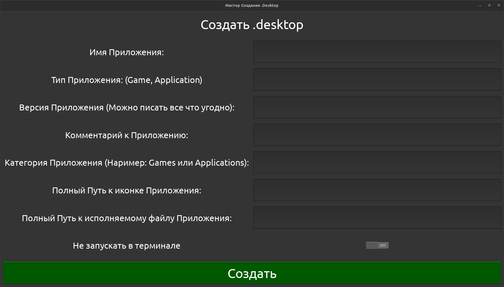

# .Desktop-File-Creator
Create .desktop file for GNU / LINUX

[+] Имя приложения
[+] Комментарий к приложению
[+] Иконка приложения
[+] Запускать приложение в терминале?
[+] Тип приложения
[+] Категория приложения
